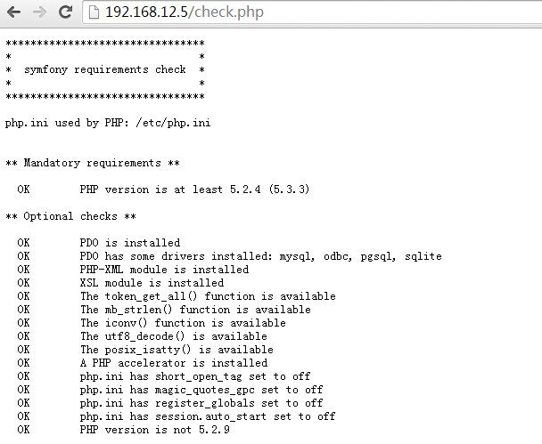
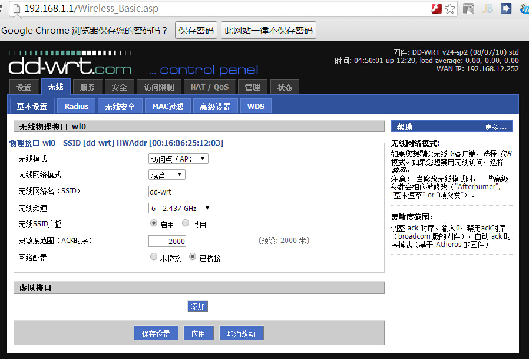
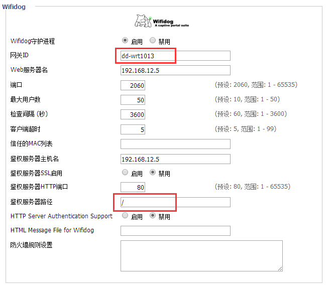
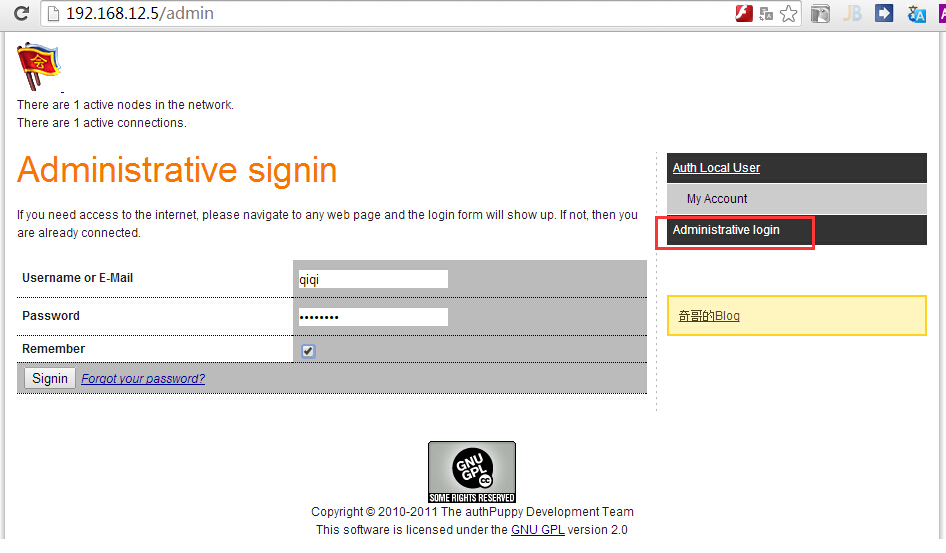
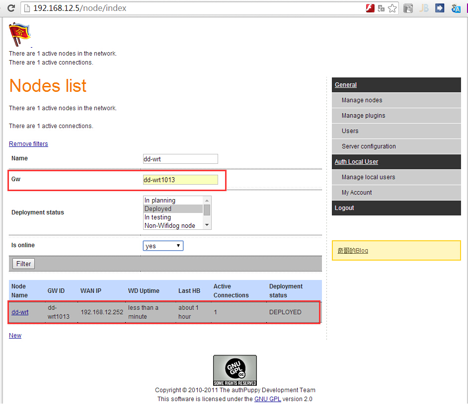
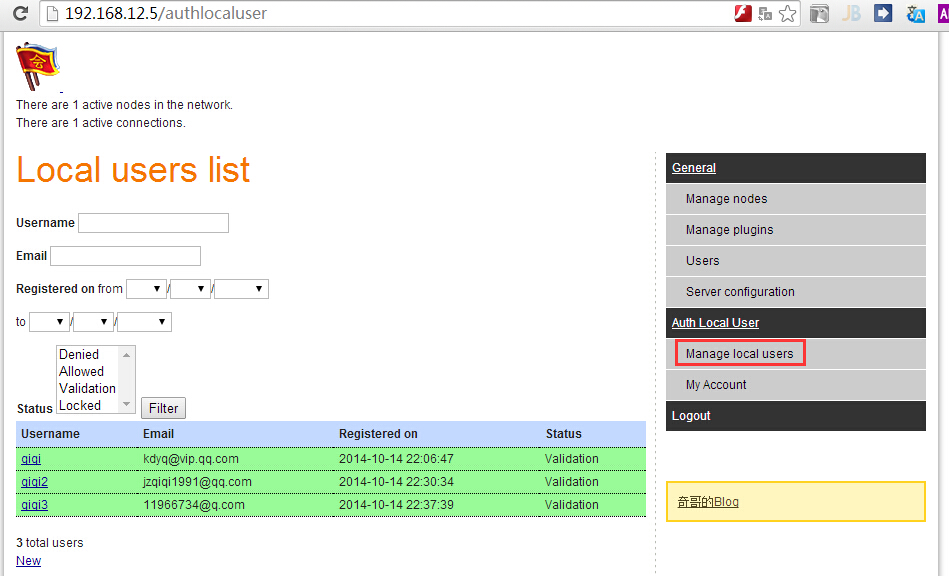
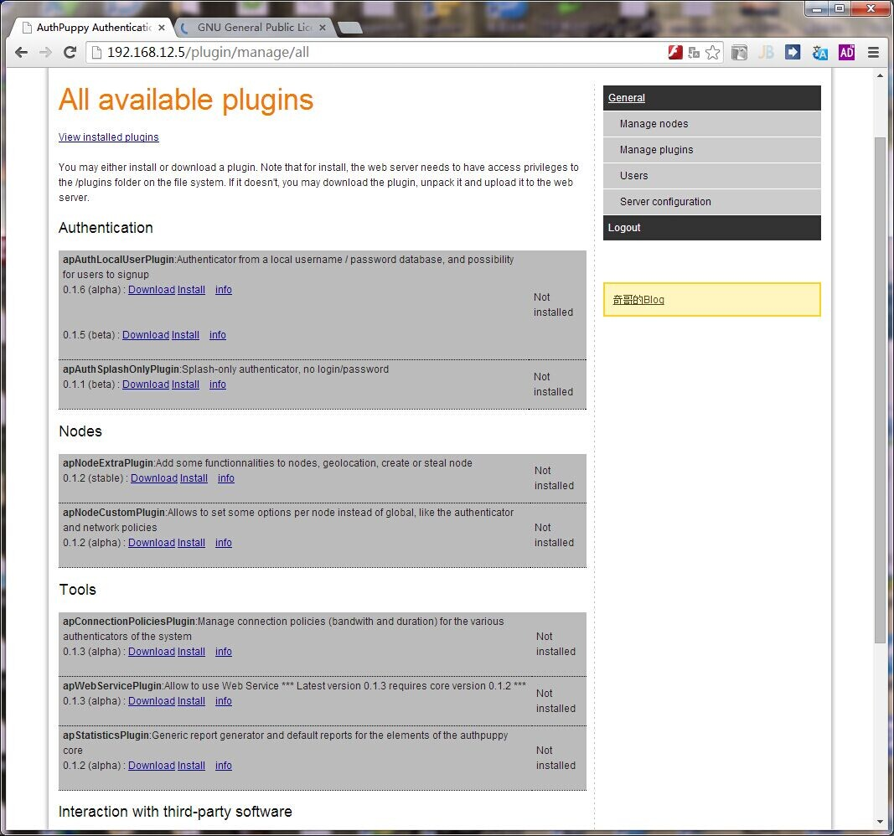
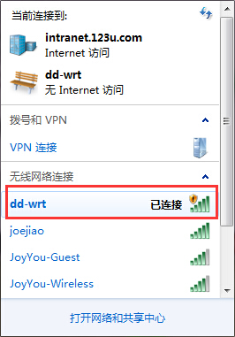
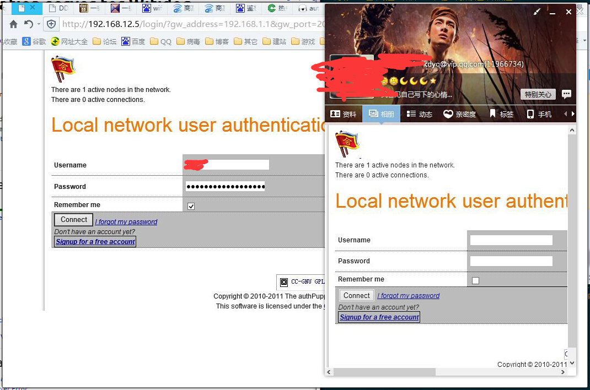
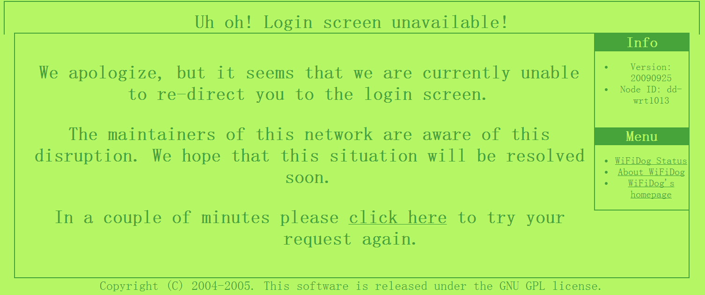

# DDwrt+wifidog+authpuppy搭建专业级热点认证系统

### 一、热点认证系统简介

先来说说什么是热点认证系统，如果你有用过酒店或者机场的wifi，wifi不做任何加密，可以直接连接，只是当你连上网络后试图去浏览某些页面的时候就会被从定向到一个特定的页面要求你登录，例如移动的CMCC、CMCC-edu和电信的China-net等，都是使用的这样的技术，这就是热点登陆系统，可能也可以叫做wifi login portal。下面我们就来实际的搭建一下吧。

### 二、radius的安装

1. 设备说明

- ddwrt路由器（带有wifidog） ip:192.168.1.1

- 鉴权服务器（apache+php+mysql）ip:192.168.12.5

- 下载最新版authpuppy压缩包（官网：https://launchpad.net/authpuppy/+download）

2 . 环境搭建

- 路由刷dd-wrt系统，系统在官网搜索型号下载对应版本（官网：http://dd-wrt.com/site/support/router-database）

- 服务器搭建apache+php+mysql，不能用nginx，我第一次试了好久没成功，后来用apache直接就可以，开启rewrite，详情见官方说明文档（http://www.authpuppy.org/doc/Getting_Started）

- 解压authpuppy压缩包，放在服务器apache页面路径下（默认/var/www，/var/www/authpuppy）

3 . 安装authpuppy

- 只要环境搭建好，就能直接成功！也可以先用这个php页面测试，下载放进自己apache目录里，然后输入路径访问（http://sf-to.org/1.4/check.php），如果全部提示OK就可以了。

- 如果安装错误要删掉/var/www/authpuppy/web/目录里的installed.txt文件，然后重新开始安装。

- 安装完毕会提示输入管理员账户密码。

4 . dd-wrt路由配置

- 设置----基本设置，配置DHCP，开启，设置地址池范围，一般这里默认开启，不修改也可；

- 无线----基本设置，开启SSID广播，无限安全不做配置；

- 服务----热点，启用wifidog，自定义一个网关ID，如果有广范围有多个这样的路由器，每个网关ID都要不同，这是authpuppy区别路由器热点的唯一标识；web服务器名和健全服务器名都填authpuppy网页服务器的IP；端口默认，可以修改和authpuppy保持一致，最大用户数、检查间隔、客户端超时可以设大一点，根据实际情况，鉴权服务器路径填写`/`即可（前提是你authpuppy网页放在我的那个路径上）。

- 这时候可以输入路由器的这个地址查看wifidog的状态，能看到就OK了！http://192.168.1.1:2060/wifidog/status

- 管理----重启路由器。

5. authpuppy页面配置

- 输入页面地址，会自动弹出登录提示，用管理员身份登录；

- 配置节点，这里节点名称随便写，而下面的GW就是前面路由上填的网关ID了，一定要填写一样的，我这里是dd-wtr1013。通过认证后下面的列表就会显示出网关ID的信息，包括外网IP等；

- 管理登录账户，点击右边的Manage Local Users，new添加用户、邮箱、密码即可，当然目前用户也是可以自行注册。

6. 到这里基本就已经完成了，剩下的就是认证页面定制、修改认证模块与自己的业务挂钩、使用对应的插件等等，可在官网去下载源码和查看开发文档（https://launchpad.net/authpuppy）

### 三、测试
1. wifi可以直接连接，只是还不能直接上网；

2. 此时打开任何页面，都会跳转到我们的认证页面；

3. 登录后，可正常上网。

4. 如果你的dd-wrt路由的wifidog和authpuppy认证服务器链接不通不能认证，则会弹出下面这样的wifidog错误页面，方便查找原因。

### 实验完成