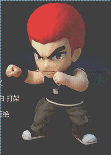
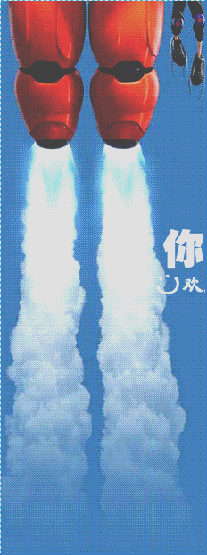
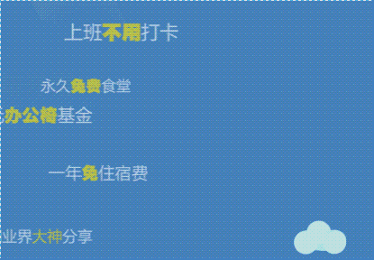
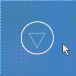

# 微信html5页面开发经验文档
### 一、各种页面特效的使用说明
##### 1.js简单的显示、隐藏

`show()`

`hide()`


##### 2.jquery的淡入淡出
加载jquery：
`<script src="http://game.wechat.123u.com/lib/publiclibs/jquery.min.js"></script>`


`fadein()`

`fadeout()`





##### 3.TweenMax.min.js由小放大动画
加载TweenMax.min.js:
`<script src="http://game.wechat.123u.com/lib/publiclibs/TweenMax.min.js"></script>`

使用方法：
```
消失：
TweenMax.to($(pages[0]).find('.text1'), 0, {opacity: 0, marginTop: Math.round(marginInt * 1)});
        TweenMax.to($(pages[0]).find('.text2'), 0, {opacity: 0, scale: 2, marginTop: Math.round(marginInt * 5.8 * 2)});
        
显示：

	$('#img2-text').show(); //必须先显示
	TweenMax.to($('#img2-text'), 0, {opacity: 0});
	TweenMax.to($('#img2-text'), 0.8, {opacity: 1, scale: 2, delay: 0.5});
    
    //opacity:透明度，1显示，0隐藏； 
    scale:样式类型，通常1~2； 
    delay：由小到放大的持续时间；
    ...
    更多参数请谷歌
```


##### 4.由屏幕外移入或移出的jquery自定义封装动画
```
 //封装动画函数
 	//移出
    function animateOut(id, animation) {
        $(id).removeClass(animation + ' animated').addClass(animation + ' animated').one('webkitAnimationEnd mozAnimationEnd MSAnimationEnd oanimationend animationend', function () {
            $(this).removeClass(animation + ' animated');
            $(this).hide();
        });
    }
    
	//移入
    function animateIn(id, animation) {
            $(id).removeClass(animation + ' animated').addClass(animation + ' animated').one('webkitAnimationEnd mozAnimationEnd MSAnimationEnd oanimationend animationend', function () {
            $(this).removeClass(animation + ' animated');
        });
    }
```

使用方法：
```
animateOut("#start","fadeOutRight");
animateIn("#img2-1","fadeInLeft");
...Up
...Down
```






##### 5.CSS3的缓动效果
`.right { display:none; position: fixed;bottom: 25px;left: 77%;z-index: 150;width:40px;height: 40px;margin-left: -20px;-webkit-animation-name:arrowUpDown; -webkit-animation-duration:.4s; -webkit-animation-iteration-count: infinite; -webkit-animation-direction: alternate; -webkit-animation-timing-function:linear;}`
`@-webkit-keyframes arrowUpDown { 0% { bottom:10px;opacity:0;}100% {bottom:22px;opacity:1;}}`


有位置和闪动时间的参数，.4s是指0.4秒闪烁一次





##### 6.jquery旋转
```
$('#ring').show();
var angle = 0;
setInterval(function(){
	angle +=3;
	$('#ring').rotate(angle);
}, 50);
```
时间、旋转角度可自行调整


### 二、功能性使用说明
##### 1.重构屏幕点击事件，提高优先级
重构点击事件，转点击事件为touchstart事件，提高优先级，解决因优先级落后导致的点击延迟问题（手机屏幕上滑动事件等优先级高于点击事件）
```
 //重构
;(function () {
var isTouch = ('ontouchstart' in document.documentElement) ? 'touchstart' : 'click', _on = $.fn.on;
$.fn.on = function () {
		arguments[0] = (arguments[0] === 'click') ? isTouch : arguments[0];
		return _on.apply(this, arguments);
	};
})();


//触发：
$("#yinmu1,#yinmu2,#txt2,.hit").click(function () {

});
```


##### 2.倒计时功能
```
 var time=61;

function Countdown(){
        time--;
        if(time < 0){
            if(time==-1){
                GameOver();
            }
            return null;
        }
        $('#Countdown').children('a').text('00:'+time+' S');
        setTimeout(function(){
            Countdown();
        },500);
    }
```


##### 3.进度条
```
html:
<div id="progress"><span></span></div>

CSS:
#progress {
    position: absolute;
    height: 3px;
    padding: 2px;
    border: 2px solid black;
    width: 36%;
    left: 32%;
    bottom: 9%;
    border-radius: 4px;
    z-index: 1070;
}
#progress span {
    background: red;
    height: 3px;
    text-align: center;
    padding: 2px;
    margin: -2px;
    display: block;
    width: 100%;
}

JS:
if (change < num[page]) {
            change++;
            $("#progress > span").css("width", String(100 - change * 100 / num[page]) + "%");
        }
```


##### 4.游戏分数显示
```
html：
<div id="score"></div>

CSS:
#score {
    display: none;
    text-align: center;
    position: absolute;
    width: 30%;
    height: 30%;
    right:0%;
    top: -15%;
    z-index: 2000;
    background: url('../images/baoji.png') no-repeat center center;
    background-size: cover;
}

#score img {
    margin-top: 12%;
    height: 40%;
}

JS:
 //显示分数
    function displayScore() {
         var scoreStr=score.toString();
         $("#score").empty();
        for(i=0;i<scoreStr.length;i++) {
            $("#score").append('');
        }
    }
```


##### 5.横竖屏判断
```
html：
<body onorientationchange="hengshuping();">
    <div id="pingmu" style="background: url(res/images/pingmu.png) no-repeat top center;width: 100%;height: 100%;background-size: cover;position:fixed;z-index: 10000;display: none;"></div>
</body>

JS:
function hengshuping(){
    if(window.orientation==180||window.orientation==0){
        $('#pingmu').hide();
        alert('竖屏')；
    }
    if(window.orientation==90||window.orientation==-90){
        $('#pingmu').show();
        alert(‘横屏’);
    }
}
```


##### 6.输入框获取焦点与失去焦点事件
```
html:
<input type="text" id="phoneNum" maxlength="11" onfocus="enter_num()" onblur="num_blur()" style="display: none;margin-top: 2%;">

CSS（圆角、边框效果）：
#phoneNum{
    margin-top: 1%;
    border-radius:10px;
    width: 40%;
    height: 37px;
    /*margin-left: 1px;*/
    border: solid;
    z-index: 2;
    background-image: url('../images/phoneNum.png');
    background-repeat: no-repeat;
    background-position: center center;
    background-size: 110%;
}

JS：
//号码框获取焦点
function enter_num(){
    document.getElementById('phoneNum').style.backgroundImage="none";
};

//号码框失去焦点
function num_blur(){
    var txt =$('#phoneNum').val();
    if(txt==null||txt=="")
        document.getElementById('phoneNum').style.backgroundImage="url('res/images/phoneNum.png')";
};
```


##### 7.校验手机号码
```
  //正则表达式匹配手机号码 以及 获取骚年礼包的ajax返回信息
    $('#enter').click(function () {
        var a = document.getElementById('phoneNum').value;
        if (!(/^1[3|4|5|7|8][0-9]\d{8}$/.test(a))) {
            alert("不是完整的11位手机号");
        }
        else {
            //console.log('asdf');
            $.ajax({
                url: "http://sn.huanle.com/open/weichat_sms.php",
                //jsonp: "callback",
                dataType: "json",
                data: {
                    mobile: a
                },
                error: function(xhr, status, error) {
                    console.log("error");
                },
                success: function( response ) {
                    console.log('ok');
                    console.dir(response);
                    if(response.status == 1){
                        $("#pager6_msg").show();
                    }else{
                        alert('对不起，该手机号已经领取过礼包！');
                    }
                }
            });
        }
    });
```


##### 8.我们自己的公共分享、统计库
```
加载公共库：
<script src="http://game.wechat.123u.com/lib/joycommon/JoyCommon.js"></script>

设置微信分享信息：
<script>
        WeiXinShare.ShareData.img = "http://game.wechat.123u.com/html/mszp/res/images/logo.png";
        WeiXinShare.ShareData.url =  "http://game.wechat.123u.com/html/mszp/index.html";
        WeiXinShare.ShareData.title = "天才招聘启事";
        WeiXinShare.ShareData.desc = "年薪12-18w  需要各路天才加入一起超神！快快分享给基友、闺蜜一起组队。";
        WeiXinShare.ShareData.afterShareUrl = document.location.href;
    </script>
```


##### 9.上传头像的模块（前端+服务端）
预览地址：http://10.0.128.219:8080/crop-avatar/crop-avatar.html
文件路径：10.0.128.219：/var/www/crop-avatar/

前端文件：crop-avatar.html
后端文件：crop-avatar.php


##### 10.背景音乐播放
```
html:
 <div  style="display: none;">
	<audio src="res/sounds/song.mp3" id="audio" controls="controls" loop="loop"></audio>
 </div>

js:
 $("#audio")[0].play()
```


